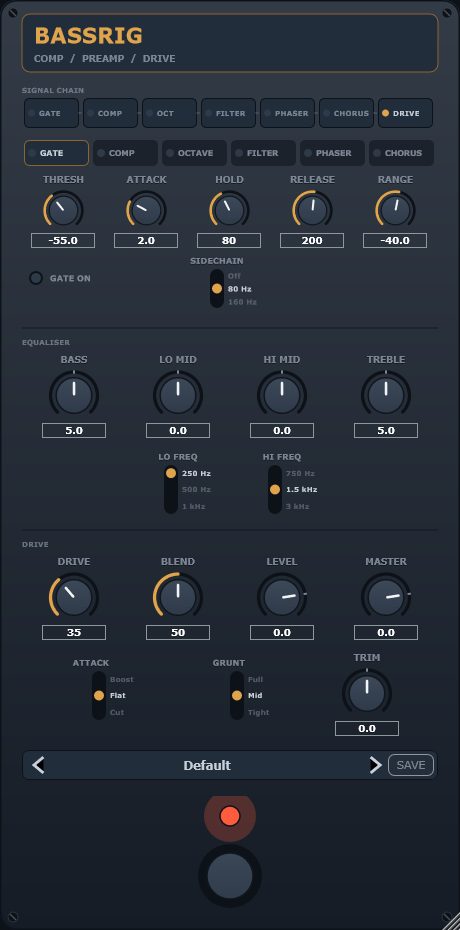

# BassRig

[](https://github.com/siipo/MyBassRig/actions/workflows/ci.yml)

A bass pedalboard as a VST3 plugin. Seven pedals in a chain you can reorder,
built around the idea that a bass effect is not a guitar effect with the treble
turned down.



## What is in it

| Pedal | The bass-specific part |
|---|---|
| **Noise gate** | Sidechain-filtered key, hysteresis, and a hold long enough to survive the ripple in a plucked bass envelope |
| **Compressor** | Sidechain high-pass, so a low B does not pump the whole band. Off it pulls 20 dB of gain reduction from a fundamental that should not be driving the detector at all |
| **Octaver** | Analogue-style frequency divider rather than a pitch tracker, because tracking a 31 Hz note costs 60 ms. A Growl control lifts the octave's harmonics, since an octave below the low strings is mostly under 40 Hz |
| **Envelope filter** | Three voices in the spirit of an EBS BassIQ, plus a high-pass mix-in that blends dry string definition back over a resonant low-pass |
| **Phaser** | A crossover, because phase accumulates across the all-pass chain and a sweep floor alone does not protect the fundamental |
| **Chorus** | A crossover at 150–250 Hz, below which nothing moves. Two modulated voices from one LFO |
| **Preamp / drive** | Multiband: the low end never enters the clipper at full strength. ADAA anti-aliased cascade, WDF Baxandall tone stack, two semi-parametric mids |

Plus thirteen factory presets, user preset save and load, and host program
integration.

## The chain is reorderable

Drag the chips in the SIGNAL CHAIN strip. Drive-into-filter and
filter-into-drive are different sounds, and the gate belongs at the front for
pickup hum or at the back for drive hiss depending on what you are fighting.

Reordering is lock-free: the set of pedals never changes, only the order they
are visited in, so the whole permutation packs into a single atomic word. See
section 3l of `DESIGN.md`.

## Building

Requires CMake 3.22+ and a C++20 compiler. JUCE, chowdsp and Catch2 are fetched
automatically on first configure — nothing is vendored.

```bash
cmake -B build -G "Visual Studio 17 2022" -A x64
cmake --build build --config Release
```

CMake 4 needs `LANGUAGES C CXX`, which is already set — JUCE fails without a C
compiler.

Artefacts land in `build/BassRig_artefacts/Release/`: a VST3 bundle and a
standalone application.

### Tests

```bash
./build/BassRigTests_artefacts/Release/BassRigTests.exe
```

95 test cases. They are measurements rather than smoke tests — aliasing against
a deliberately naive build, blend phase coherence at the comb frequencies,
octave tracking through a decaying note.

### Validation

Unit tests only ever listen to the audio, which is not the whole contract a
plugin has to keep. `pluginval` checks the other half — state restoration,
parameter thread safety, bus layouts, block sizes from 1 to 8192, sample rate
changes mid-stream:

```bash
pluginval --strictness-level 10 --repeat 10 --randomise --validate build/BassRig_artefacts/Release/VST3/BassRig.vst3
```

The repeat count is not decoration. Its state test draws random values and
forgives a draw that lands near a step, so a broken build passes about one run
in five. The first time it ran it found a real bug that all 94 tests had missed;
see `DESIGN.md` section 3p.

CI builds and runs all of this on Linux, macOS and Windows on every push.

### Looking at the UI

`tools/Snapshot.cpp` renders the editor to PNG with no window and no host, one
image per rack tab:

```bash
./build/BassRigSnapshot_artefacts/Release/BassRigSnapshot.exe snapshots
```

## DESIGN.md

`DESIGN.md` is the interesting file. It is a running record of what was measured
and what that measurement changed, including the things that turned out to be
wrong — a phaser plan that did not survive contact, a WDF justification that
measurement disproved, three separate wrong diagnoses of an octaver fault, and
two regression tests that looked correct and were testing nothing.

## Licence

**AGPL-3.0.** JUCE's free option requires it and it propagates. See
`THIRD_PARTY.md` for the full dependency picture and for what would have to
change to license this any other way.

## Status

Everything here is measured, and the measurements are recorded in `DESIGN.md`
rather than summarised. What that does **not** yet include is a systematic
listening comparison against reference hardware or other plugins.

It has been played. Two of the bugs in `DESIGN.md` — the octave that vanished
on the low strings, and the octave that jumped up as notes decayed — were found
that way and not by any test, which is a fair indication of how much a test
suite can and cannot tell you here.

So: the voicing values are chosen so each control is measurably distinct and
evenly spread across its travel. That is a proxy for sounding good, not the
thing itself, and several of them (the Grunt corners at 5 / 100 / 250 Hz, the
recovery low-pass at 5 kHz, the interstage gain of 1.8) are still first guesses
in that sense.
